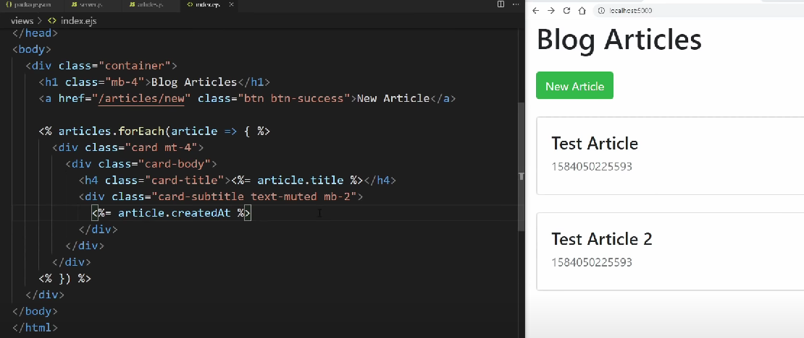

### Lab 5 rework Lite Fast

Use css bootstrap for more easy desene;
ExpresJS, NodeJS, MongoDB.

### Working Process and details
The From is the same for Add and edit buttons because not reason to use over that look same
#
#
#
Start to create container for form

#
#
#
The look of finish Form

#
#
#
Some smoll things cannot save a post with nothing insaid

#
#
#
The Post's will be arange from the new to old

#
#
#
Start render form form _form_fields.js

#
#
#
Some security

#
#
#
And working New Article buton(I add after and date current and edit and delet)

